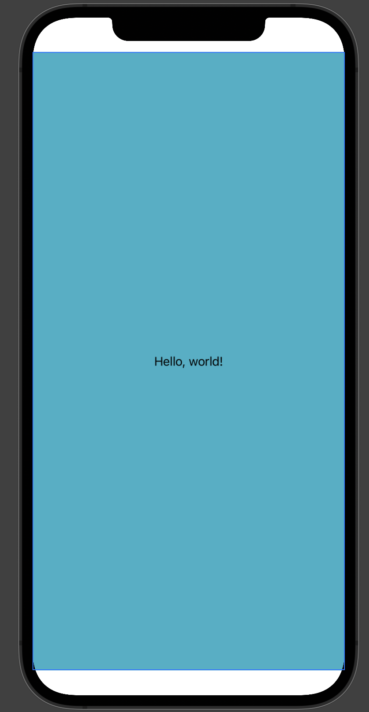
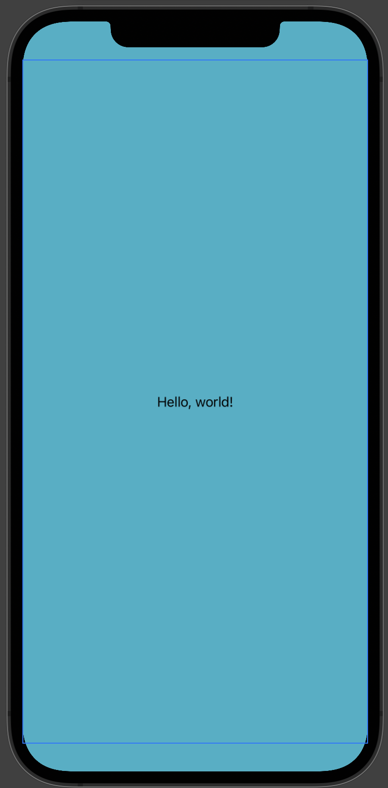

# Color
Represents a color
```swift
ZStack {
  Color(.systemTeal)
  Text("Hello, world!")
}
```


## EdgesIgnoringSafeArea
Extend outside the safe areas of the screen:
```swift
ZStack {
  Color(.systemTeal)
    .edgesIgnoringSafeArea(.all)
  Text("Hello, world!")
}
```

