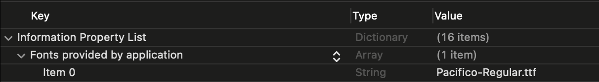

# Font

## Apple Developer Documentation
[SwiftUI Font](https://developer.apple.com/documentation/swiftui/font)

## Custom font
### Requirements
Custom font file must be located inside the project  


Info.plist must contain Key "Fonts provided by application" with array of font file names  


### Implementation
```swift
Text("Hello, world!")
        .font(Font.custom("Pacifico-Regular", size: 40))
        .bold()
        .foregroundColor(.white)
```

