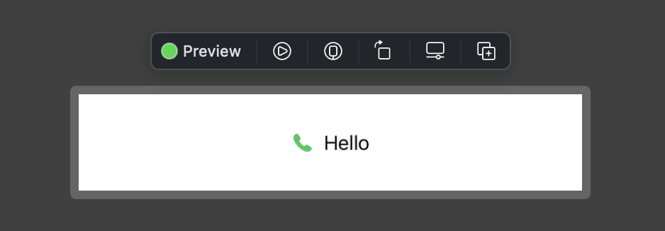

# View

## Apple Developer Documentation
[SwiftUI View](https://developer.apple.com/documentation/swiftui/view)

## Custom View #1

```swift
import SwiftUI

struct InfoView: View {
  let text: String
  let imageName: String

  var body: some View {
    RoundedRectangle(cornerRadius: 25)
      .fill(Color.white)
      .frame(height: 50)
      .overlay(HStack {
        Image(systemName: imageName)
          .foregroundColor(.green)
        Text(text)
      })
      .padding(.all)

  }
}

struct InfoView_Previews: PreviewProvider {
    static var previews: some View {
      InfoView(text: "Hello", imageName: "phone.fill")
        .previewLayout(.sizeThatFits)
    }
}
```


